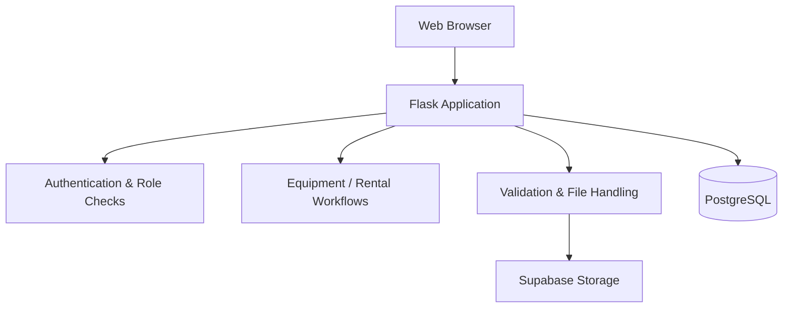

# 🌾 Krishi Rental — Agricultural Equipment Rental Platform

> A full-stack Flask platform for organizing agricultural equipment rental workflows across equipment owners, farmers, quality-control operations, and administrators.

[](https://www.python.org/)
[](https://flask.palletsprojects.com/)
[](https://www.postgresql.org/)
[](https://supabase.com/)
[](https://gunicorn.org/)

## Product overview

Krishi Rental is a database-driven web application for agricultural equipment rental. The system brings equipment, users, rental activity, file uploads, and operational workflows into a single application.

The repository contains a Flask backend, PostgreSQL persistence, Supabase integration, server-rendered templates, static assets, SQL schema, and deployment configuration.

## Why the project is interesting

The application is not just a CRUD interface. It demonstrates several backend concerns that appear in real applications:

- Role-aware workflows
- Authentication and authorization
- Relational database access
- File validation and storage
- Session management
- Environment-based configuration
- Deployment configuration

## 👥 Role-aware application model

The application contains role-aware flows for:

| Role | Application responsibility |
|---|---|
| **Admin** | Administrative control and platform management |
| **Producer** | Equipment / producer-side workflows |
| **Farmer** | Rental and user-facing workflows |
| **QC** | Quality-control related workflows |

Access is enforced in the Flask application through authentication and role checks.

## 🏗️ Architecture



## 🔐 Security-oriented implementation

The codebase includes several practical protections and defensive patterns:

- Environment variables for service credentials
- Session-based authentication
- Role-based route protection
- Filename sanitization using `secure_filename`
- File-extension allowlisting
- Upload-size limiting
- Generated storage paths to reduce filename collisions
- Separation of application secrets from source code

The application explicitly avoids hard-coding production service credentials and uses environment-based configuration for deployment.

## ☁️ Data & storage architecture

### PostgreSQL

The application uses PostgreSQL through `psycopg2` and reads the database connection from `DATABASE_URL`.

### Supabase

Supabase is used for application/storage integration, including uploaded media. The storage bucket can be configured through an environment variable.

### Local development configuration

The repository includes environment-oriented configuration and an example deployment setup rather than requiring credentials to be committed to source control.

## 🧩 Main components

```text
app.py
 ├── Flask routes
 ├── authentication / authorization
 ├── business workflows
 ├── database access
 ├── upload validation
 └── Supabase storage integration

 database.sql       → relational schema
 requirements.txt   → Python dependencies
 Procfile           → deployment entry point
 static/            → frontend assets
 templates/         → server-rendered UI
```

## 📁 Repository structure

```text
.
├── app.py
├── database.sql
├── requirements.txt
├── Procfile
├── render_update.json
├── homepagebackground/
├── static/
└── templates/
```

## ⚙️ Technology stack

**Backend**  
Python · Flask · psycopg2

**Database**  
PostgreSQL

**Storage / Platform**  
Supabase

**Frontend**  
HTML · CSS · JavaScript · Jinja2

**Deployment**  
Gunicorn · Procfile · environment configuration

## 🚀 Local setup

### 1. Create a virtual environment

```bash
python -m venv .venv
```

Activate the environment using the command appropriate for your operating system.

### 2. Install dependencies

```bash
pip install -r requirements.txt
```

### 3. Configure environment variables

Provide the application's database, Supabase, storage-bucket, and Flask secret configuration through environment variables.

### 4. Run the application

For development, run the Flask application according to the entry points in `app.py`. For hosted deployments, the repository includes a `Procfile` for Gunicorn-based execution.

## 🧪 Engineering review checklist

When evaluating the project, the most relevant files are:

- `app.py` — application logic, routes, security and storage integration
- `database.sql` — database schema
- `requirements.txt` — runtime dependencies
- `Procfile` — deployment configuration

## Project status

Active portfolio project demonstrating full-stack application development and backend engineering patterns.

## Author

**Manvanth M.**  
Python · Flask · PostgreSQL · Supabase · Full-Stack Development

[← Back to GitHub profile](https://github.com/ManvanthM)
